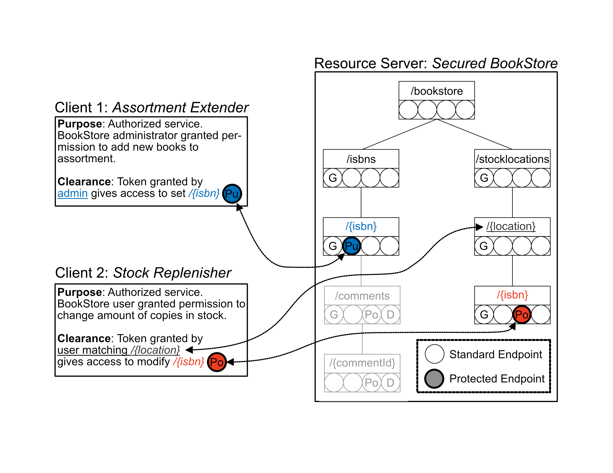

# Spring Security OAuth2 Samples

A minimal sample setup that
reflects [OAuth2 service access delegation](https://datatracker.ietf.org/doc/html/rfc6749) for
administrators and users.

## About

OAuth2 is a security protocol to delegate access for a secured REST API. This repository contains a
well documented and explained sample setup for access delegation on behalf of service administrators
and service users.

### Origins

The code in this repository is based on one
of [Baeldung's Spring-Security sample projects](https://github.com/Baeldung/spring-security-oauth/tree/master/oauth-authorization-server),
namely the "oauth-authorization-server" project. For more details on Baeldungs original tutorial,
see: [Baeldung.com](https://www.baeldung.com/spring-security-oauth-auth-server).

### OAuth2 Protocol

Purpose of OAuth2 is to authorize a third party service (named *Client*) to access secured
endpoints of an existing API (*Resource Server*).
The interest of OAuth2 is to enable a secure access, without requiring the original API user (*
*Resource Owner**) to share their credentials with the *Client*. This is achieved by means of
cryptographic tokens issued by an additional service (*Authorization Server*).

As such, the key entities in any OAuth2 interplay are the following three RESTful services:

* A **Resource Server**: Offers a resource, belonging to a *Resource Owner*. The latter is
  usually a biological or legal person.
* A **Client**: Requests to access a protected resource of the *Resource Server*, to perform actions
  on behalf of the *Resource Owner*.
* An **Authorization Server**: Center part of the OAuth2 protocol and provider of secure
  tokens to allow impersonation of the *Resource Owner* by the *Client*.

The *Authorization Server* is often a preexisting entity, e.g. a service provided by an established
tech company. For educative purposes and to maintain versatility this project brings it's own
off-the-shelf implementation.

#### Communication Layout

The effective OAuth2 communication layout varies, depending on how roles are separated or fused:

* In essence, these variants differ in *how the granted authorization* is transferred back from
  **Authorization Server** to **Client**.
* The above process of transferring the authorization is called [**Authorization Grant
  **](https://datatracker.ietf.org/doc/html/rfc6749#section-1.3) in protocol jargon.
* There are different **Authorization Grant** types, but here we only deal with the standard case:
    * Parties place minimal trust in one another.
    * Parties are fully separated executables (services).
* This standard type is called [**Authorization Code Grant
  **](https://datatracker.ietf.org/doc/html/rfc6749#section-4.1), in protocol jargon.

Below schema illustrates the communication flow for the standard **Authorization Code** type:

```
     +--------+                               +---------------+
     |        |--(A)- Authorization Request ->|   Resource    |
     |        |     (is a redirect to AS)     |     Owner     |
     |        |<------------------------------|               |
     |        | (B.3) RO forwards Auth. Code) +---------------+
     |        |                                  ^   ^
     |        |            (B.1) Page Forward    |   |  (B.2) RO grants auth.
     |        |             & grant form reply   v   v   & AS returns Auth. Code
     |        |                               +---------------+
     |        |--(C)-- Authorization Grant -->| Authorization |
     | Client |                               |     Server    |
     |        |<-(D)----- Access Token -------|               |
     |        |                               +---------------+
     |        |
     |        |                               +---------------+
     |        |--(E)----- Access Token ------>|    Resource   |
     |        |                               |     Server    |
     |        |<-(F)--- Protected Resource ---|               |
     +--------+                               +---------------+
```

> Note: The above layout is based on the official protocol specification. Additional arrows were
> added to better illustrate the *Request Reply* nature of the underlying HTTP protocol.
> Steps ```B.1-B.3``` reflect the **Authorization Code** communication.

## Context

This repository reflects the [standard protocol entities](#oauth2-protocol). However, instead of a
single *Client*, the repo contains two, to better illustrate the two most prominent use cases of
access delegation with OAuth2:

### Authorization Scenarios

1) Delegation of *Resource Server* API access on behalf of a service *Administrator*. The *Resource
   Owner* is an administrator of the *Resource Server*.  
   Here the *Resource Server* is accessed by a *Client*, who wishes to access a REST
   endpoint intended for administrators, and therefore likewise requires authorization by a
   *Resource Server* administrator.
2) Delegation of *Resource Server* API access on behalf of a service *User*. The *Resource
   Owner* is a user of the *Resource Server*.  
   Here the *Resource Server* is accessed by a *Client*, who wishes to access a REST
   endpoint intended for their personal use. Therefore, this access likewise requires authorization
   by the exact same *Resource Server* user.

### Service Entities

This repository contains the following four services:

* [**Resource Server**](resource-server): A slightly modified version
  of [the BookStore](https://github.com/m5c/BookStoreInternals). The relatively small API has been
  secured, to allow for OAuth2 secured access of selected REST endpoints.
* [**Authorization Server**](spring-authorization-server): A mostly off the shelf implementation of
  Springs default OAuth2 *Authorization Server*.
* [**Admin Client (Assortment Extender)**](assortment-client-server): A first OAuth2 *Client*, which
  uses the OAuth2
  protocol to request access, and subsequently modify the bookstore's assortment. Note that this
  catalogue of all indexed books is considered under the governance of a *Resource Service*
  administrator.
* [**User Client (Stock Replenisher)**](stock-client-server): A second OAuth2 *Client*, which uses
  the OAuth2
  protocol to request access, and subsequently modify a local store's stock (amount of copies in
  store). The corresponding resource is considered under the governance of a local store manager
  user, who grants access to the selected REST resource of the **Resource Server** on their behalf.

Illustration of the secured access:  


* The right side illustrates the REST resources and access points of the modified bookstore. Circles
  with thicker stroke indicate REST methods that are access protected.
* The clients on the left each request access to one respective protected resource using the OAuth2
  protocol. Subsequently, these services interact with the bookstore on behalf of the grantee.
    * **Client 1**: *Assortment Extender* is granted access to the **[PUT]** operation on
      resource `/bookstore/isbns/{isbn}`, which allows adding new books to the global assortment.
      This resource is considered owned by an *administrator* of the *Resource Server*. Therefore,
      access is denied unless the *Resource Owner* is in the `ADMIN` group.
    * **Client 2**: *Stock Replenisher* is granted access to the **[POST]** operation on
      resource `/bookstore/stocklocations/{location}/{isbn}`, which allows changing the amount of
      copies in store for a given book and location. This resource is considered owned by an
      *standard user* of the *Resource Server*, who is in charge of a corresponding store.
      Therefore, access is denied unless the *Resource Owner*'s name matches the `{location}` URL
      parameter.

## Technical Details

Several changes were made, with respect to
the [original Baeldung example](https://www.baeldung.com/spring-security-oauth-auth-server):
The main difference is that the referenced OAuth2 example showcases no notion for user-owned
resources, and hence matching of resource and username. Likewise, the original configuration does
not verify user roles, to
ensure access is matched against user privileges.

Several changes were necessary, to implement these standard usecases:

* The original *Resource Server* was replaced by
  the [BookStore](https://github.com/m5c/BookStoreInternals), to provide a minimum of API complexity
  and legit context for the two types of access delegation: *Service-User* access delegation and
  *Service-Admin* access delegation.
* One protected resource has been configured to use Spring's expression language (SpEL), to
  crosscheck a URL parameter of the resource against their username. This scenario is indicated by
  mappings between *red* markers in the figure above.
    * The access protection takes place [in the *Resource Server*, and uses a ```@PreAuthorize```
      annotation](resource-server/src/main/java/com/baeldung/web/GlobalStockController.java).
* A second protected resource has been configured to require an *Administrator* role of the
  authorizing user. This second scenario is indicated by mappings between *blue* markers in the
  figure above.  
  This second scenario required several technical changes:
    * By default, details on the authorizing user (*Resource Owner*) and accessing *Client* are
      transmitted by means of a signed `Json Web Token`. The token is used by the *Client* while
      accessing a
      protected method at the *Resource Server*. Token details did not contain information on the
      *Resource Owner*'s group affiliation (administrator or standard user). Therefore, the [
      *Authorization Server*](spring-authorization-server) issuing this token has been reconfigured
      to contain this information in the token.
    * Likewise the receiving end does not readily consider the additional token information (also
      called *claim*) for interpretation, and subsequent access rules. Therefore, the *Resource
      Server* [has been configured to extract and interpret the additional token claim](resource-server/src/main/java/com/baeldung/config/FusedClaimConverter.java).
    * Finally the *Resource Server* has been [configured to actually use the transmitted grantee
      group information, to decide on accept / reject of incoming requests](resource-server/src/main/java/com/baeldung/web/AssortmentController.java)
      from the OAuth2 *Client*.

## Usage

TODO: REVISE.
This section explains how to start up and test the micro service, to verify correct configuration of
the protocol.

Here is how to start up the service interplay and test secured resource access:

0) Add this entry to your `etc/hosts` file: `127.0.0.1 auth-server`
1) Start the Authorization Server:  
   `cd spring-authorization-server; mvn clean package spring-boot:run`
2) Start the Resource Server:  
   `cd resource-server; mvn clean package spring-boot:run`
3) Start the Client:  
   `cd client-server; mvn clean package spring-boot:run`
4) Access the client:  
   Open [http://127.0.0.1:8080/articles](http://127.0.0.1:8080/assortmentextensions)  
   Use the credentials "assortmentextender", "password"
5) Verify a new book is in the catalogue, and can be publicly accessed:  
   `curl -X GET http://127.0.0.1:8090/bookstore/isbns/3518368540`

## Contact / Pull Requests

* Original repo code, without the aforementioned
  modifications: [GitHub: baeldung](https://github.com/Baeldung/spring-security-oauth/tree/master/oauth-authorization-server)
* Original Baeldung tutorial: [Baeldung](https://www.baeldung.com/spring-security-oauth-auth-server)
* Above changes: [GitHub: m5c](http://github.com/m5c)

### Community discussions

Essnetial parts of described security roles were based on recommendations from the StackOverflow
community.
Notably these two posts provide essential finger posts and technical details:

* *...*
* *...*
